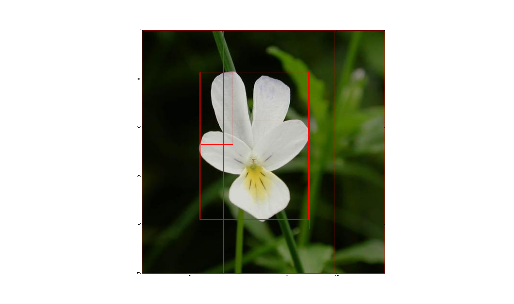

# RCNN 
Rich feature hierarchies for accurate object detection and semantic segmentation
# 工程内容
这个程序是基于tensorflow的tflearn库实现部分RCNN功能。

# 开发环境
windows10 + python3.5 + tensorflow1.2 + tflearn + cv2 + scikit-learn

# 数据集
采用17flowers据集, 官网下载：http://www.robots.ox.ac.uk/~vgg/data/flowers/17/

# 程序说明
1、setup.py---初始化路径   
2、config.py---配置   
3、tools.py---进度条和显示带框图像工具   
4、train_alexnet.py---大数据集预训练Alexnet网络，140个epoch左右，bitch_size为64   
5、preprocessing_RCNN.py---图像的处理（选择性搜索、数据存取等）   
6、selectivesearch.py---选择性搜索源码   
7、fine_tune_RCNN.py---小数据集微调Alexnet   
8、RCNN_output.py---训练SVM并测试RCNN（测试的时候测试图片选择第7、16类中没有参与训练的，单朵的花效果好，因为训练用的都是单朵的）

# 文件说明
1、train_list.txt---预训练数据，数据在17flowers文件夹中      
2、fine_tune_list.txt---微调数据2flowers文件夹中   
3、1.png---直接用选择性搜索的区域划分        
           
4、test/2.png---通过RCNN后的区域划分     
   

# 程序问题
1、由于数据集小的原因，在微调时候并没有像论文一样按一个bitch32个正样本，128个负样本输入，感觉正样本过少；   
2、还没有懂最后是怎么给区域打分的，所有非极大值抑制集合canny算子没有进行，待续；   
3、对选择的区域是直接进行缩放的；   
4、由于数据集合论文采用不一样，但是微调和训练SVM时采用的IOU阈值一样，有待调参。

# 参考
1、论文参考：https://www.computer.org/csdl/proceedings/cvpr/2014/5118/00/5118a580-abs.html    
2、代码参考：http://www.cnblogs.com/edwardbi/p/5647522.html         
            https://github.com/edwardbi/DeepLearningModels/tree/master/RCNN     
3、博客参考：http://blog.csdn.net/u011534057/article/details/51218218      
            http://blog.csdn.net/u011534057/article/details/51218250 

